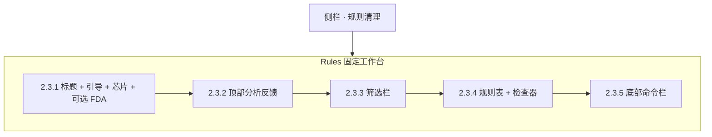
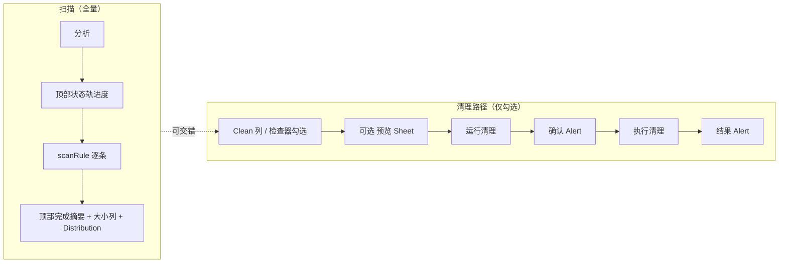

# RFC 010：规则工作区 — 基于规则的扫描列表、预览、确认与清理（详细 UI 设计）

**状态**：已批准（React Rules 工作台、顶部分析反馈与响应式布局修订）
**创建日期**：2026-04-12
**最后更新**：2026-07-28
**作者**：CleanSpace

**权威说明**：规则清理详情列的 **布局、组件、尺寸、模态与无障碍** 仅以 **本文第二部分** 为准。Apple 官方对照链接见 `docs/macos-swiftui-references.md`（非 UI 细稿）。修改规则页 UI 规范时 **只改本 RFC**。

---

## 第一部分：摘要、决策与协作

### 1.1 摘要

- **平台**：macOS 15+（Sequoia）；默认桌面入口为 Velox + React，SwiftUI 辅助入口保持相同行为语义。
- **信息架构（本轮提案）**：固定工作台 + 顶部分析反馈 + 单一主滚动规则表 + 宽屏检查器/紧凑抽屉 + 底部命令栏。
- **单一主操作面**：分析 / 预览 / 运行清理仅在 **`RulesCommandBar`**；规则主列表页 **无** 重复 `primaryAction` 工具栏三按钮（D1）。
- **行为语义**：**「分析」** 对 **全部已加载规则** 扫描（更新大小列与图表数据）；**「预览」「运行清理」** 仅针对 **已勾选** 规则。
- **协作**：`AGENTS.md` 基线 + Persona；`/swiftui` 与 `docs/persona/paul-hudson.md`。

### 1.2 与 RFC 001 的边界

| RFC 001 | 本 RFC 010 |
|---------|------------|
| 可清理路径、风险、安全边界 | **如何**在界面呈现勾选、扫描、预览、确认与结果 |
| 「删什么」 | 「在哪点、什么顺序、什么控件」 |

### 1.3 冻结的产品决策（交互语义）

| ID | 决策 |
|----|------|
| D1 | 规则主列表页 **不得** 使用与命令栏三动作重复的 `ToolbarItemGroup(placement: .primaryAction)`。 |
| D2 | 根 `NavigationSplitView` 详情侧可保留 `toolbarBackground` / `toolbarBackgroundVisibility`。 |
| D3 | 预览 Sheet 可使用 `confirmationAction`（如「完成」）。 |
| D4 | **分析** = 全量规则扫描，**不**依赖勾选。 |
| D5 | **预览 / 运行清理** = 仅勾选集。 |
| D6 | 详情区垂直顺序见 **第二部分 §2.3**；变更顺序须同步本文与实现。 |
| D7 | 运行清理前 **确认 Alert**；完成后 **结果 Alert**。 |
| D8 | **勾选清理**（`selectedRuleIds`）与 **表行焦点**（`tableSelection` / 检查器）**分离**：点行只聚焦检查器；纳入/移出清理集仅通过 Clean 列 Toggle 或检查器「纳入清理」。 |
| D9 | **分析 / 预览 / 清理互斥 busy**：`isScanning` 时禁用预览与清理；`isCleaning` 时禁用分析与预览。 |
| D10 | 点击分析后，进度必须固定显示在标题下方；不得渲染在规则主体或图表之后。 |
| D11 | 分析完成、部分失败或失败摘要复用同一顶部反馈区，直到再次分析或用户关闭。 |
| D12 | 规则表是工作区唯一主纵向滚动区；标题、反馈、筛选与命令栏不得随表滚动。 |
| D13 | 宽屏检查器常驻右侧；紧凑窗口使用右侧抽屉，不使用表下堆叠长页面。 |
| D14 | 分类容量分布进入检查器 `Distribution` 视图；不得在表下重复显示圆环、柱图与数据表。 |
| D15 | 金色队列轨道表示待清理；灰色焦点状态表示当前详情。两种状态可同时存在且不得混淆。 |
| D16 | 底部命令栏只负责队列摘要与三主动作，不承担分析进度或完成结果。 |

### 1.4 协作索引（AGENTS / Persona）

- `AGENTS.md`：黄金法则、工程基线、Persona 表、快捷指令（含 `/swiftui`）。
- `docs/persona/paul-hudson.md`：SwiftUI 实现协作参考。

---

<a id="detailed-ui-spec"></a>

## 第二部分：详细 UI 设计（规范性）

本节为 **规则基于扫描列表、预览、确认与清理** 的完整界面规格；默认以
`apps/desktop/src` React 实现对照验收，SwiftUI 辅助入口须保持 D1–D9 行为语义。

### 2.1 范围

| 包含 | 不包含 |
|------|--------|
| 侧栏「规则清理」/「AI 工具 · 空间」/「性能」共用的 Rules 工作区 | 「磁盘」「Docker」「监控」工作区的细稿（可另文） |
| 预览 Sheet、确认/结果 **Alert** 结构 | 像素级 Figma；独立品牌色体系 |
| React 工作台、分析反馈、检查器、命令栏、响应式规则 | Velox 生命周期与 IPC 契约 |

### 2.2 信息架构

```text
Application Shell
├── Sidebar：完整侧栏（宽屏）/ 72 pt 图标轨道（紧凑）
└── Rules Workspace
    ├── Title + guide + overview
    ├── RulesActivityBanner（分析进度 / 完成 / 部分失败 / 失败）
    ├── RulesFilterToolbar
    ├── Workbench
    │   ├── RulesTable（唯一主滚动区）
    │   └── RulesInspector（宽屏侧栏 / 紧凑抽屉）
    │       ├── Details
    │       └── Distribution
    └── RulesCommandBar（队列摘要 + 分析 / 预览 / 清理）
```

- **宽屏验收**：1120×792；完整侧栏，表格与检查器并排。
- **紧凑验收**：840×700；72 pt 图标轨道，表格全宽，检查器为右侧抽屉。
- **工作区**：`grid-template-rows: auto auto auto minmax(0, 1fr) auto`；所有祖先链设置 `min-height: 0`。
- **滚动所有权**：仅规则表承担主纵向滚动；检查器只滚动自身详情；页面无横向滚动。

### 2.3 详情区纵向结构（自上而下）

**唯一权威顺序**；React 对应 `RulesWorkspace`，SwiftUI 辅助入口保持等价行为。

```
┌─────────────────────────────────────────────────────────────┐
│ 2.3.1 顶栏：标题 + 一行引导 + 统计芯片 + 可选 FDA            │
├─────────────────────────────────────────────────────────────┤
│ 2.3.2 RulesActivityBanner（分析进度 / 结果，按需显示）        │
├─────────────────────────────────────────────────────────────┤
│ 2.3.3 RulesFilterToolbar（搜索 / 分类 / 排序 / 批量）        │
├─────────────────────────────────────────────────────────────┤
│ 2.3.4 Workbench：RulesTable + RulesInspector                 │
│        检查器含 Details / Distribution                       │
├─────────────────────────────────────────────────────────────┤
│ 2.3.5 底部：RulesCommandBar（队列摘要 + 分析·预览·清理）     │
└─────────────────────────────────────────────────────────────┘
```

### 2.4 视觉与材质 Token

| Token | 值 / 说明 |
|-------|-----------|
| `--color-background` / Void | `#0D0F12`；页面背景 |
| `--color-surface` / Graphite | `#15181D`；表、筛选与命令栏 |
| `--color-border` / Steel | `#2A3038`；结构边界 |
| `--color-text` / Chalk | `#F4F5F7`；主文本 |
| `--brand-accent` / Reclaim Gold | `#E6B82F`；分析主动作、清理队列、容量分布 |
| `--color-danger` / Destructive Red | `#E36B6B`；仅可执行破坏性动作 |
| 字体角色 | macOS system UI；路径、ID、容量使用 `SF Mono` / `ui-monospace` |
| 动效 | 抽屉 160 ms；进度 200 ms；遵守 `prefers-reduced-motion` |

### 2.5 组件规格

#### 2.5.1 顶栏引导与统计芯片

| 元素 | 规格 |
|------|------|
| 引导 | 标题下方单行说明；紧凑窗口允许省略号，不使用占高的大卡片 |
| 芯片 | 总数 / 已选 / 已扫描；已选使用 accent，其余保持 secondary |
| FDA | 分析捕获权限拒绝时展示 `FullDiskAccessBanner`（文案与触发见 RFC 004） |

> **历史**：早期 `CSRulesOverviewPanel`（大图标 + overview 标题副文）已由顶栏引导 + 芯片取代；源文件可保留作参考，**非**现行验收对象。

#### 2.5.2 顶部分析反馈（RulesActivityBanner）

位于顶栏与筛选栏之间。首次分析前隐藏；出现后不参与规则表滚动。

| 状态 | 必须显示 |
|------|----------|
| `scanning` | 当前规则、完成数 / 总数、百分比与进度轨 |
| `completed` | 已测量规则数、可回收总量、完成时间语义 |
| `partial` | 成功数、失败数、可回收总量与查看错误入口 |
| `failed` | 明确错误原因与可恢复操作 |

- 完成、部分失败和失败状态保持到再次分析或用户关闭。
- 状态变化使用 `aria-live`；普通进度 `polite`，不可恢复失败 `assertive`。
- 不使用自动消失 toast 作为唯一结果反馈。

#### 2.5.3 筛选栏（RulesFilterToolbar）

| 元素 | 规格 |
|------|------|
| 标题 | `L10n.Rules.filterSectionTitle`，`subheadline.weight(.semibold)` |
| 搜索 | `TextField` + magnifyingglass；占位 `filterSearchPlaceholder` |
| 分类 / 排序 | `Picker` `.menu`（分类数 > 1 时显示分类） |
| 可见计数 | `filterVisibleFormat` |
| 批量 | 全选全部 / 全选当前结果 / 清空；紧凑窗口收进单个菜单 |

#### 2.5.4 命令栏（RulesCommandBar）— **扫描 / 预览 / 清理主控**

固定置于工作区底部。

| 区域 | 规格 |
|------|------|
| 队列摘要 | 已选规则数 + 已知可回收量；未分析时显示明确占位 |
| 辅文 | 下一步提示，例如“可预览”或“先选择规则” |
| **主按钮** | **分析**：`borderedProminent` `large`，`.help(helpScan)`；**预览**：`bordered` `large`，`.help(helpDryRun)`；**运行清理 / 优化**：`borderedProminent` `large` **red**（性能为 bolt），`.help(helpClean)` |
| 禁止内容 | 分析进度、分析完成摘要、错误结果；这些只属于 `RulesActivityBanner` |

**启用规则（D9）**：

- **分析**：`rulesNonEmpty` 且 **非** `isScanning` 且 **非** `isCleaning`。
- **预览**：`selectedCount > 0` 且 **非** `isScanning` 且 **非** `isCleaning`。
- **运行清理**：`selectedCount > 0` 且 **非** `isScanning` 且 **非** `isCleaning`。

> **历史**：中部 `CSRulesCleanWorkflowCard` 已由底部 `RulesCommandBar` 取代；**非**现行验收对象。

#### 2.5.5 容量分布（RulesInspector · Distribution）

| 元素 | 规格 |
|------|------|
| 位置 | 检查器第二个标签，与 `Details` 并列 |
| 内容 | 分类排名水平条 + 容量 + 占比 |
| 禁止 | 同时显示圆环、水平条、数据表；只保留一种可比较表达 |
| 空状态 | 未分析时说明“分析后显示分类分布”，不展示 0% 假数据 |

#### 2.5.6 统一规则表（RulesTable）— **主扫读面**

| 列 | 宽度 / 行为 |
|----|-------------|
| Clean | **52 pt**（`RulesUnifiedTableLayout.cleanColumnWidth`）；Toggle `labelsHidden`；`accessibilityLabel` = 规则名；`accessibilityHint` = `listA11yToggleHint` |
| Item | min **180**（性能紧凑态 **220**） |
| Type | **72 pt**（非性能 scope 显示） |
| Category | min **88**（多分类时显示） |
| Size / Impact | **108 pt**（`RulesScanListLayoutMetrics.scanColumnWidth`）；路径格 `.help` = `listHelpScanColumn` |
| Risk | **56 pt**（`riskColumnWidth`），`RuleRiskChip` |
| 样式 | `tableStyle(.inset(alternatesRowBackgrounds: true))` |
| 选择语义 | **D8**：`tableSelection` 仅驱动检查器焦点；**不得**因点行增删 `selectedRuleIds` |
| 队列语义 | 已勾选行显示 3 pt 金色左轨；焦点仅显示中性边界/底色 |
| 滚动 | 表头 sticky；表体为工作区唯一主纵向滚动区 |

#### 2.5.7 检查器（RulesInspector）

| 布局 | 规格 |
|------|------|
| 宽屏 | 工作台右侧；`minWidth` **240** / ideal **280** / max **320** |
| 紧凑窗口 | 右侧抽屉；Escape 关闭；关闭后表格恢复全宽 |
| 内容 | `Details` / `Distribution` 两标签；保持焦点规则 |
| 路径 | `overflow-wrap: anywhere`；只允许纵向滚动，禁止横向滚动条 |
| 纳入清理 | Toggle；须带 `listA11yToggleHint`（与表 Clean 列一致） |
| 空焦点 | `ContentUnavailableView` 风格提示选中一行 |

#### 2.5.8 遗留组件（非现行主路径）

以下仍可存在于仓库，供对照或局部复用，**不再作为规则主工作区验收对象**：

- `RulesScanListRow`、`BrowserRulesTableBlock`（列宽常量仍与统一表对齐）
- `CSRulesOverviewPanel`、`CSRulesCleanWorkflowCard`（`WorkspaceChrome.swift`）

### 2.6 模态：预览（演练）与确认/结果

#### 2.6.1 预览 Sheet（RulesDryRunSheet）

- `NavigationStack` + grouped `Form`；`navigationTitle` = `L10n.Rules.dryRunSheetTitle`。
- 内容：免责声明 + 按规则分 Section 列出路径或命令（等宽可选中）。
- 工具栏：**仅** `confirmationAction` 完成按钮（`dismiss`）。
- **最小尺寸**：`minWidth` **440**，`minHeight` **380**（可按内容微调，须保持可读）。

#### 2.6.2 确认清理 Alert

- `isPresented` 绑定「运行清理」前置状态。
- 标题：`L10n.Rules.alertConfirmTitle`。
- 按钮：**取消**（`Common.cancel`）+ **运行清理**（destructive，执行 `performClean`）。
- **message**：动态（低风险条数 / 含中高风险提示），来自既有 `L10n` 逻辑。

#### 2.6.3 结果 Alert

- 标题：`L10n.Rules.alertResultTitle`。
- 按钮：`Common.ok`（**勿**使用 `role: .cancel`）。
- **message**：多行清理结果（每规则一行格式由 `L10n` 定义）。

### 2.7 空状态

- 无规则：`ContentUnavailableView`：`rules.empty.title` / `rules.empty.description`，`doc.text`；最小高度约 **280 pt**。
- 筛选无结果：`filterNoResultsTitle` / `filterNoResultsDescription`，填满表区域。

### 2.8 无障碍（验收清单）

- [ ] 命令栏三主按钮均有 `.help`（`L10n.Rules.helpScan` / `helpDryRun` / `helpClean`）。
- [ ] 表 Clean Toggle 与检查器纳入 Toggle：`accessibilityHint` = `listA11yToggleHint`；无标签 Toggle 须有 `accessibilityLabel`（规则名）。
- [ ] 顶部分析反馈通过 `aria-live` / SwiftUI 等价语义播报；进度、完成与失败可理解。
- [ ] Cmd-F 聚焦搜索；方向键移动焦点；Space 切换清理队列；Escape 关闭紧凑检查器。
- [ ] 用户可见字符串 **仅** `L10n` + `en` / `zh-Hans` `Localizable.strings`。

### 2.9 流程图（Mermaid）

**与 §2.3～§2.6 冲突时以表格为准。**

**图 A — 详情区纵向区块**



**图 B — 扫描 → 勾选 → 预览 → 确认 → 清理 → 结果**



### 2.10 实现映射

| 规格对象 | 代码路径 |
|----------|----------|
| React Shell / 响应式侧栏 | `apps/desktop/src/App.tsx`、`apps/desktop/src/app.css` |
| React 工作台 | `apps/desktop/src/rules/RulesWorkspace.tsx` |
| 顶部分析反馈 | `apps/desktop/src/rules/RulesActivityBanner.tsx` |
| 筛选 / 表格 | `apps/desktop/src/rules/RulesFilterToolbar.tsx` |
| 检查器 / Distribution | `apps/desktop/src/rules/RulesInspector.tsx`、`RulesCategoryChart.tsx` |
| 底部命令栏 | `apps/desktop/src/rules/RulesCommandBar.tsx` |
| 状态 | `apps/desktop/src/rules/useRulesWorkspace.ts` |
| React 文案 | `apps/desktop/src/i18n/messages.ts` |
| SwiftUI 辅助入口 | `CleanSpaceKit/Rules/RulesWorkspaceView.swift`、`RulesWorkspaceLayout.swift` |

**变更流程**：改布局、尺寸或顺序 → **先改本文第二部分** 与 Mermaid；改「分析是否全量」等语义 → 同步 **§1.3 冻结决策**。

---

## 第三部分：验收标准

1. 实现与 **第二部分** 无冲突（顺序、滚动所有权、反馈位置、按钮启用、Sheet/Alert、§2.8）。
2. 满足 **§1.3 D1–D16**。
3. 1120×792 与 840×700 真实 `Cleaning Dev.app` 窗口无裁切、无页面横向滚动。
4. 点击 Analyze 后 200 ms 内，标题下方出现进度；完成/部分失败/失败保持在同一位置。
5. 表是唯一主纵向滚动区；紧凑检查器为可关闭抽屉；路径不会产生横向滚动。
6. React typecheck、测试与现有 icon/i18n 检查通过；Swift build/test 不因共享契约回归。
7. `AGENTS.md`、README、ROADMAP、TASK_TRACKING 指向本 RFC 唯一路径。

---

## 第四部分：相关文件与后续可选

| 类型 | 路径 |
|------|------|
| Apple HIG / SwiftUI 索引 | [docs/macos-swiftui-references.md](../../docs/macos-swiftui-references.md) |
| 协作 | `AGENTS.md`，`docs/persona/paul-hudson.md` |

**后续可选**：应用菜单/快捷键（仍遵守 D1）；删除或归档遗留 `CSRulesCleanWorkflowCard` / `CSRulesOverviewPanel` — 须 **先改本文** 再改代码。

---

## 第五部分：实施计划（2026-07-28 React 工作台修订）

实施检查清单：

1. **TASK-010-06 — 分析反馈状态**
   - 新增 `apps/desktop/src/rules/scanActivity.ts`，定义 `RulesScanActivity` 判别联合及完成态生成纯函数。
   - 先新增 `scanActivity.test.ts`，覆盖进行中、完整完成、受限路径导致的部分完成、失败与关闭。
   - `useRulesWorkspace.ts` 以单一 `scanActivity` 状态驱动开始、进度、完成、部分完成和失败；完成态保持到下一次分析或关闭。
2. **TASK-010-06 — 顶部反馈组件**
   - 新增 `RulesActivityBanner.tsx`，在 `RulesWorkspace.tsx` 标题区之后、筛选区之前渲染。
   - 进行中使用确定进度；完成、部分完成与失败复用同一容器并允许关闭；容器使用 `role="status"` / `aria-live="polite"`。
   - `RulesCommandBar.tsx` 删除进度计数，只保留动作标签与队列摘要。
3. **TASK-010-07 — 固定工作台与单一滚动**
   - 重排 `RulesWorkspace.tsx`：固定标题/反馈/筛选，中央 `rules-workbench` 占剩余高度，底部命令栏固定。
   - `app.css` 将纵向滚动所有权收敛到 `.rules-table-pane`；移除整页 `.rules-workspace-scroll` 与检查器独立主滚动高度上限。
4. **TASK-010-08 — 宽屏与紧凑布局**
   - 宽屏保留右侧检查器；`max-width: 900px` 下侧栏变 72px 图标轨道，导航文字视觉隐藏但保留无障碍名称。
   - 紧凑模式检查器改为覆盖式右侧抽屉并提供关闭按钮；长路径 `overflow-wrap: anywhere`，页面禁止横向滚动。
5. **TASK-010-09 — Distribution 与选择语义**
   - `RulesInspector.tsx` 增加 `Details` / `Distribution` 标签；Distribution 内只渲染分类条形分布。
   - `RulesCategoryChart.tsx` 去除圆环与重复数据表；`RulesWorkspace.tsx` 删除表下图表与显示开关。
   - 表行焦点使用中性灰；清理队列使用独立金色轨道，两种状态允许叠加。
6. **TASK-010-10 — 文案、测试与验收**
   - `messages.ts` 同步 en / zh-Hans Activity、标签、抽屉关闭文案；移除用户可见硬编码 `Loading…`、`No rules`、`Select`。
   - 运行 React 单测、TypeScript 构建、根 `pnpm build`；再用 `pnpm dev` 启动 `Cleaning Dev.app`，在 1120×792 与 840×700 验收反馈位置、滚动、抽屉和无横向裁切。
   - 验收通过后同步 `TASK_TRACKING.md` 与 `ROADMAP.md`；未通过项保持进行中，不宣称完成。

### 5.1 实施状态（2026-07-28）

| 项目 | 状态 | 证据 |
|------|------|------|
| TASK-010-06～09 | 已完成 | React 状态/组件测试 16/16；1120×792 `Cleaning Dev.app` 实机确认顶部部分完成摘要、固定工作台与 Distribution |
| React / Velox 构建 | 已完成 | TypeScript 无错误；`pnpm build:app:dev` 成功；Dev bundle 签名与指定要求有效 |
| Swift 回归 | 已完成 | XCTest 54/54；Swift Testing 62/62 |
| 840×700 实机 | 进行中 | `velox.json` 与 Dev bundle 已写入 840×700；当前运行进程仍持有旧 1020×720 原生窗口下限，遵守不终止进程约束，待下次冷启动验收 |

---

## 修订历史

| 日期 | 说明 |
|------|------|
| 2026-04-12 | 多轮迭代（工具栏、列表、L10n、Mermaid、Persona 等） |
| 2026-04-12 | 曾误拆「RFC 仅决策 / design 仅细稿」引发双源 |
| 2026-04-12 | **纠正**：**详细 UI 设计全部并入本文第二部分**；RFC 为单一权威 |
| 2026-04-12 | 删除 `docs/design/`；HIG 索引迁至 `docs/macos-swiftui-references.md` |
| 2026-07-18 | **对齐现行实现**：统一表 + 检查器 + 底部命令栏；D8/D9；归档 Form/中部流程卡规格 |
| 2026-07-28 | 重新打开评审：React 固定工作台、顶部分析反馈、单一主滚动区、紧凑检查器抽屉与 Distribution 标签 |
| 2026-07-28 | 用户批准 React 工作台修订；冻结 D10–D16 与第五部分实施清单 |
| 2026-07-28 | TASK-010-06～09 实施完成；TASK-010-10 保留 840×700 冷启动实机验收 |
