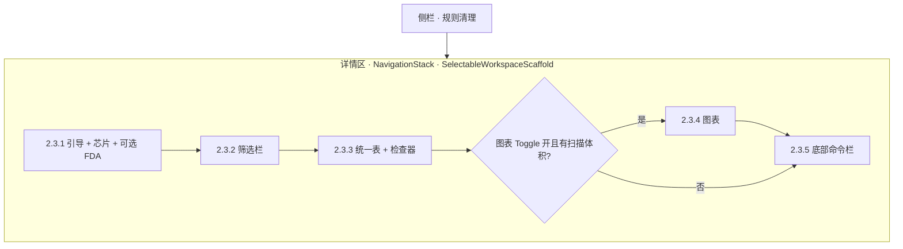
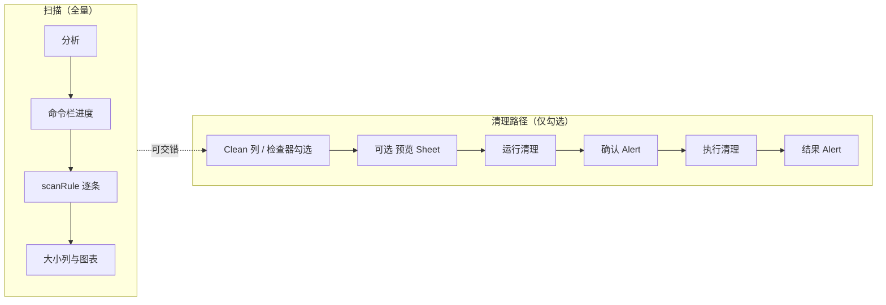

# RFC 010：规则工作区 — 基于规则的扫描列表、预览、确认与清理（详细 UI 设计）

**状态**：已完成（**本文含规范性 UI 细稿**；主验收已落地；可选应用菜单共享动作见 TASK-010-05）  
**创建日期**：2026-04-12  
**作者**：CleanSpace  

**权威说明**：规则清理详情列的 **布局、组件、尺寸、模态与无障碍** 仅以 **本文第二部分** 为准。Apple 官方对照链接见 `docs/macos-swiftui-references.md`（非 UI 细稿）。修改规则页 UI 规范时 **只改本 RFC**。

---

## 第一部分：摘要、决策与协作

### 1.1 摘要

- **平台**：macOS 15+（Sequoia）；详情区对齐系统「设置」类应用：`NavigationSplitView`、`Material`、`.help()`。
- **信息架构（现行）**：**统一规则表**（`RulesUnifiedTable`）+ **侧栏/堆叠检查器** + **底部粘性命令栏**（`RulesCommandBar`）；非早期「分组 Form + 中部流程卡」布局。
- **单一主操作面**：分析 / 预览 / 运行清理仅在 **`RulesCommandBar`**；规则主列表页 **无** 重复 `primaryAction` 工具栏三按钮（D1）。
- **行为语义**：**「分析」** 对 **全部已加载规则** 扫描（更新大小列与图表数据）；**「预览」「运行清理」** 仅针对 **已勾选** 规则。
- **协作**：`AGENTS.md` 基线 + Persona；`/swiftui` 与 `docs/persona/paul-hudson.md`。

### 1.2 与 RFC 001 的边界

| RFC 001 | 本 RFC 010 |
|---------|------------|
| 可清理路径、风险、安全边界 | **如何**在界面呈现勾选、扫描、预览、确认与结果 |
| 「删什么」 | 「在哪点、什么顺序、什么控件」 |

### 1.3 冻结的产品决策（交互语义）

| ID | 决策 |
|----|------|
| D1 | 规则主列表页 **不得** 使用与命令栏三动作重复的 `ToolbarItemGroup(placement: .primaryAction)`。 |
| D2 | 根 `NavigationSplitView` 详情侧可保留 `toolbarBackground` / `toolbarBackgroundVisibility`。 |
| D3 | 预览 Sheet 可使用 `confirmationAction`（如「完成」）。 |
| D4 | **分析** = 全量规则扫描，**不**依赖勾选。 |
| D5 | **预览 / 运行清理** = 仅勾选集。 |
| D6 | 详情区垂直顺序见 **第二部分 §2.3**；变更顺序须同步本文与实现。 |
| D7 | 运行清理前 **确认 Alert**；完成后 **结果 Alert**。 |
| D8 | **勾选清理**（`selectedRuleIds`）与 **表行焦点**（`tableSelection` / 检查器）**分离**：点行只聚焦检查器；纳入/移出清理集仅通过 Clean 列 Toggle 或检查器「纳入清理」。 |
| D9 | **分析 / 预览 / 清理互斥 busy**：`isScanning` 时禁用预览与清理；`isCleaning` 时禁用分析与预览。 |

### 1.4 协作索引（AGENTS / Persona）

- `AGENTS.md`：黄金法则、工程基线、Persona 表、快捷指令（含 `/swiftui`）。
- `docs/persona/paul-hudson.md`：SwiftUI 实现协作参考。

---

<a id="detailed-ui-spec"></a>

## 第二部分：详细 UI 设计（规范性）

本节为 **规则基于扫描列表、预览、确认与清理** 的完整界面规格；与 `CleanSpaceKit` 实现对照验收。

### 2.1 范围

| 包含 | 不包含 |
|------|--------|
| 侧栏「规则清理」/「AI 工具 · 空间」/「性能」共用的 **`RulesWorkspaceView` 详情列** | 「磁盘」「Docker」「监控」工作区的细稿（可另文） |
| 预览 Sheet、确认/结果 **Alert** 结构 | 像素级 Figma；独立品牌色体系 |
| **布局常量名**（与代码一致） | — |

### 2.2 信息架构

```
NavigationSplitView
├── Sidebar：… / 规则清理 / …
└── Detail
    └── NavigationStack
        ├── navigationTitle（按 scope：规则清理 / AI 工具 / 性能）
        ├── navigationSubtitle（可选）：已选 n / 共 m 条
        ├── toolbar（可选）：图表显隐 Toggle（非三主动作）
        └── SelectableWorkspaceScaffold（§2.3～§2.8）
```

- **内容最大宽**：`CS.selectableWorkspaceMaxWidth` = **1120 pt**，水平居中（宽表 + 检查器；磁盘/Docker 等 Form 页仍用 `DetailScaffold` **840 pt**）。
- **边距**：水平 `CS.detailHorizontalPadding` = **24 pt**（筛选栏、引导、图表、命令栏）。
- **工具栏**：允许 **图表显隐** Toggle；**禁止** 与命令栏重复的 primaryAction 三图标（D1）。

### 2.3 详情区纵向结构（自上而下）

**唯一权威顺序**；对应 `RulesWorkspaceView.selectableBody`。

```
┌─────────────────────────────────────────────────────────────┐
│ 2.3.1 顶栏：CSWorkspaceGuideBanner + 统计芯片                 │
│        （可选）FullDiskAccessBanner（RFC 004）               │
├─────────────────────────────────────────────────────────────┤
│ 2.3.2 RulesFilterToolbar（搜索 / 分类 / 排序 / 可见计数）    │
├─────────────────────────────────────────────────────────────┤
│ 2.3.3 RulesWorkspaceTableInspectorLayout                     │
│        ├── RulesUnifiedTable（主扫读）                       │
│        └── RulesInspectorPanel（侧栏或窄屏堆叠）             │
├─────────────────────────────────────────────────────────────┤
│ 2.3.4 图表区（可选：有路径类扫描体积且用户打开图表 Toggle）   │
├─────────────────────────────────────────────────────────────┤
│ 2.3.5 safeAreaInset 底部：RulesCommandBar（分析·预览·清理）  │
└─────────────────────────────────────────────────────────────┘
```

### 2.4 视觉与材质 Token

| Token | 值 / 说明 |
|-------|-----------|
| `CS.cornerHero` | **16 pt**，`continuous` |
| `CS.cornerPanel` | **14 pt** |
| `CS.cornerSmall` | **10 pt** |
| 图表卡 | `Material.regular`，内边距 **16 pt** |
| 筛选栏 / 命令栏 | `Material.bar`；命令栏顶部分隔线 |
| 卡片描边 | `Color.primary` **6%～8%** opacity，**1 pt** |
| 强调 | `Color.accentColor` |
| 破坏性主按钮 | `borderedProminent` + `.tint(.red)` |
| 字体角色 | 标题 `headline`；说明 `subheadline` + `secondary`；辅助 `caption` / `tertiary` |

### 2.5 组件规格

#### 2.5.1 顶栏引导与统计芯片

| 元素 | 规格 |
|------|------|
| 引导 | `CSWorkspaceGuideBanner`：按 scope 使用 `workspaceGuideStorage` / `workspaceGuideAiTools` / `workspaceGuidePerformance` |
| 芯片 | 三枚 `CSQuickStatChip`：总数 / 已选 / 已扫描（性能页为「已分析」）；已选或已扫可用 accent 强调 |
| FDA | 分析捕获权限拒绝时展示 `FullDiskAccessBanner`（文案与触发见 RFC 004） |

> **历史**：早期 `CSRulesOverviewPanel`（大图标 + overview 标题副文）已由顶栏引导 + 芯片取代；源文件可保留作参考，**非**现行验收对象。

#### 2.5.2 筛选栏（RulesFilterToolbar）

| 元素 | 规格 |
|------|------|
| 标题 | `L10n.Rules.filterSectionTitle`，`subheadline.weight(.semibold)` |
| 搜索 | `TextField` + magnifyingglass；占位 `filterSearchPlaceholder` |
| 分类 / 排序 | `Picker` `.menu`（分类数 > 1 时显示分类） |
| 可见计数 | `filterVisibleFormat` |
| 批量 | 全选可见 / 清除可见勾选 / 全选全部；`ViewThatFits` 宽屏横排、窄屏堆叠 |

#### 2.5.3 命令栏（RulesCommandBar）— **扫描 / 预览 / 清理主控**

粘性置于详情底部（`safeAreaInset(edge: .bottom)`）。

| 区域 | 规格 |
|------|------|
| 可回收 / 影响指标 | 标签 `caption` `secondary`；数值 **30 pt semibold rounded**，`monospacedDigit`；占位或需分析时 `secondary`，有可强调数据时 `accentColor` |
| 辅文 | `caption` `tertiary`（选中数、路径类/命令类计数；性能页为 impact 文案） |
| **扫描/清理进行中** | `ProgressView` `.small` + scanning / cleaning（或 boosting），`subheadline` `secondary`；`accessibilityElement(children: .combine)` |
| **主按钮** | **分析**：`borderedProminent` `large`，`.help(helpScan)`；**预览**：`bordered` `large`，`.help(helpDryRun)`；**运行清理 / 优化**：`borderedProminent` `large` **red**（性能为 bolt），`.help(helpClean)` |
| 布局 | `ViewThatFits`：宽屏指标 \| 进度 \| 按钮横排；窄屏纵向堆叠 |

**启用规则（D9）**：

- **分析**：`rulesNonEmpty` 且 **非** `isScanning` 且 **非** `isCleaning`。
- **预览**：`selectedCount > 0` 且 **非** `isScanning` 且 **非** `isCleaning`。
- **运行清理**：`selectedCount > 0` 且 **非** `isScanning` 且 **非** `isCleaning`。

> **历史**：中部 `CSRulesCleanWorkflowCard` 已由底部 `RulesCommandBar` 取代；**非**现行验收对象。

#### 2.5.4 图表区（CSChartCard + RulesScanChartBlock）

| 元素 | 规格 |
|------|------|
| 位置 | **在表与检查器之下**、命令栏之上（§2.3.4） |
| 显隐 | 有路径类正扫描体积时，工具栏 Toggle 控制 `showChart` |
| 标题 | `Label` + `chart.pie.fill`，`headline`，`titleAndIcon` |
| 图体最小高度 | **260 pt** |

#### 2.5.5 统一规则表（RulesUnifiedTable）— **主扫读面**

| 列 | 宽度 / 行为 |
|----|-------------|
| Clean | **52 pt**（`RulesUnifiedTableLayout.cleanColumnWidth`）；Toggle `labelsHidden`；`accessibilityLabel` = 规则名；`accessibilityHint` = `listA11yToggleHint` |
| Item | min **180**（性能紧凑态 **220**） |
| Type | **72 pt**（非性能 scope 显示） |
| Category | min **88**（多分类时显示） |
| Size / Impact | **108 pt**（`RulesScanListLayoutMetrics.scanColumnWidth`）；路径格 `.help` = `listHelpScanColumn` |
| Risk | **56 pt**（`riskColumnWidth`），`RuleRiskChip` |
| 样式 | `tableStyle(.inset(alternatesRowBackgrounds: true))` |
| 选择语义 | **D8**：`tableSelection` 仅驱动检查器焦点；**不得**因点行增删 `selectedRuleIds` |

#### 2.5.6 检查器（RulesInspectorPanel）

| 布局 | 规格 |
|------|------|
| 宽屏 | `HSplitView` 右侧；`minWidth` **240** / ideal **280** / max **320** |
| 窄屏堆叠 | 表下方；`minHeight` **180** / ideal **240** / max **320**（可滚动） |
| 纳入清理 | Toggle；须带 `listA11yToggleHint`（与表 Clean 列一致） |
| 空焦点 | `ContentUnavailableView` 风格提示选中一行 |

#### 2.5.7 遗留组件（非现行主路径）

以下仍可存在于仓库，供对照或局部复用，**不再作为规则主工作区验收对象**：

- `RulesScanListRow`、`BrowserRulesTableBlock`（列宽常量仍与统一表对齐）
- `CSRulesOverviewPanel`、`CSRulesCleanWorkflowCard`（`WorkspaceChrome.swift`）

### 2.6 模态：预览（演练）与确认/结果

#### 2.6.1 预览 Sheet（RulesDryRunSheet）

- `NavigationStack` + grouped `Form`；`navigationTitle` = `L10n.Rules.dryRunSheetTitle`。
- 内容：免责声明 + 按规则分 Section 列出路径或命令（等宽可选中）。
- 工具栏：**仅** `confirmationAction` 完成按钮（`dismiss`）。
- **最小尺寸**：`minWidth` **440**，`minHeight` **380**（可按内容微调，须保持可读）。

#### 2.6.2 确认清理 Alert

- `isPresented` 绑定「运行清理」前置状态。
- 标题：`L10n.Rules.alertConfirmTitle`。
- 按钮：**取消**（`Common.cancel`）+ **运行清理**（destructive，执行 `performClean`）。
- **message**：动态（低风险条数 / 含中高风险提示），来自既有 `L10n` 逻辑。

#### 2.6.3 结果 Alert

- 标题：`L10n.Rules.alertResultTitle`。
- 按钮：`Common.ok`（**勿**使用 `role: .cancel`）。
- **message**：多行清理结果（每规则一行格式由 `L10n` 定义）。

### 2.7 空状态

- 无规则：`ContentUnavailableView`：`rules.empty.title` / `rules.empty.description`，`doc.text`；最小高度约 **280 pt**。
- 筛选无结果：`filterNoResultsTitle` / `filterNoResultsDescription`，填满表区域。

### 2.8 无障碍（验收清单）

- [ ] 命令栏三主按钮均有 `.help`（`L10n.Rules.helpScan` / `helpDryRun` / `helpClean`）。
- [ ] 表 Clean Toggle 与检查器纳入 Toggle：`accessibilityHint` = `listA11yToggleHint`；无标签 Toggle 须有 `accessibilityLabel`（规则名）。
- [ ] 扫描/清理进度行 VoiceOver 可理解（合并或显式标签，须实测）。
- [ ] 用户可见字符串 **仅** `L10n` + `en` / `zh-Hans` `Localizable.strings`。

### 2.9 流程图（Mermaid）

**与 §2.3～§2.6 冲突时以表格为准。**

**图 A — 详情区纵向区块**



**图 B — 扫描 → 勾选 → 预览 → 确认 → 清理 → 结果**



### 2.10 实现映射

| 规格对象 | 代码路径 |
|----------|----------|
| `SelectableWorkspaceScaffold` / `CS` | `AppChrome.swift` |
| `RulesWorkspaceView` | `Rules/RulesWorkspaceView.swift`（由 `ContentView` 按 scope 挂载） |
| 筛选 / 检查器 / 命令栏 | `Rules/RulesWorkspaceLayout.swift` |
| 统一表 | `Rules/RulesUnifiedTable.swift` |
| 引导条 | `AppChrome/WorkspaceGuide.swift` |
| FDA 条 | `AppChrome/FullDiskAccessBanner.swift` |
| 文案 | `Localization/L10n.swift`，`Resources/*/Localizable.strings` |

**变更流程**：改布局、尺寸或顺序 → **先改本文第二部分** 与 Mermaid；改「分析是否全量」等语义 → 同步 **§1.3 冻结决策**。

---

## 第三部分：验收标准

1. 实现与 **第二部分** 无冲突（顺序、列宽、按钮启用、Sheet/Alert、§2.8 清单、**D8/D9**）。
2. 满足 **§1.3 D1–D9**。
3. `cd app && swift build && swift test` 通过；`scripts/check-swift-ui-l10n.sh`（若安装 `rg`）通过。
4. `AGENTS.md` 指向本 RFC；含 Paul Hudson 与 `/swiftui`。

---

## 第四部分：相关文件与后续可选

| 类型 | 路径 |
|------|------|
| Apple HIG / SwiftUI 索引 | [docs/macos-swiftui-references.md](../../../docs/macos-swiftui-references.md) |
| 协作 | `AGENTS.md`，`docs/persona/paul-hudson.md` |

**后续可选**：应用菜单/快捷键（仍遵守 D1）；删除或归档遗留 `CSRulesCleanWorkflowCard` / `CSRulesOverviewPanel` — 须 **先改本文** 再改代码。

---

## 修订历史

| 日期 | 说明 |
|------|------|
| 2026-04-12 | 多轮迭代（工具栏、列表、L10n、Mermaid、Persona 等） |
| 2026-04-12 | 曾误拆「RFC 仅决策 / design 仅细稿」引发双源 |
| 2026-04-12 | **纠正**：**详细 UI 设计全部并入本文第二部分**；RFC 为单一权威 |
| 2026-04-12 | 删除 `docs/design/`；HIG 索引迁至 `docs/macos-swiftui-references.md` |
| 2026-07-18 | **对齐现行实现**：统一表 + 检查器 + 底部命令栏；D8/D9；归档 Form/中部流程卡规格 |
