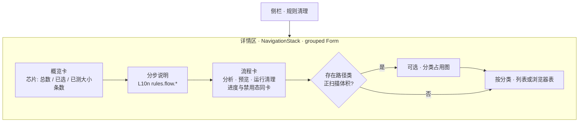
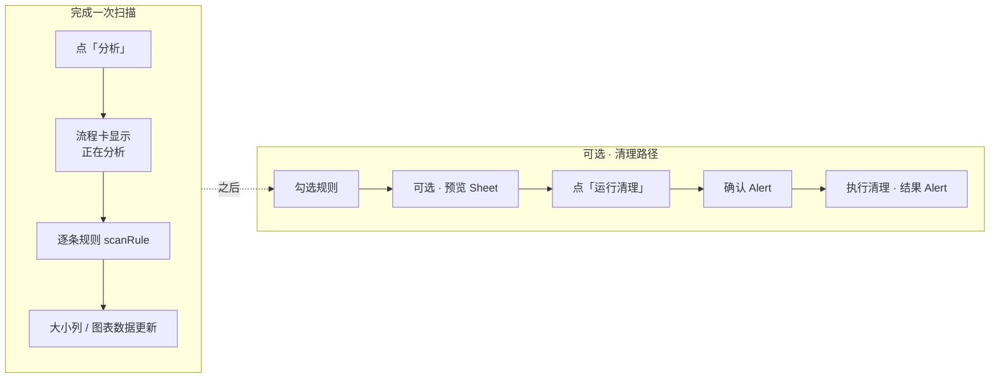

# RFC 010：规则工作区 UI（HIG）与协作索引（AGENTS / Persona）

**状态**：已批准（设计原则冻结；**主要实现已落地**；后续微调仍须符合本文与 `AGENTS.md`）  
**创建日期**：2026-04-12  
**作者**：CleanSpace  

---

## 摘要

规定 **「规则清理」主界面** 在 macOS 上的交互与视觉原则：避免 **unified 工具栏与正文重复** 的冗余操作入口；扫描列表与浏览器 **Table** 列宽与无障碍一致；进度反馈与 **主操作卡** 同区。  
同步记录 **根目录 `AGENTS.md`** 的合并结构、**Swift/SwiftUI 向 Persona（Paul Hudson 风格）** 与 **`/swiftui` 快捷指令**，便于人机协作一致。

---

## 背景与问题

1. **工具栏与内容重复**：详情区已有「分析 / 预览 / 清理」大卡，再在窗口右上角放三个同名图标，在 **unified 标题栏** 上显得拥挤，且与系统「设置」类应用 **轻量顶栏** 习惯不一致。
2. **扫描列表可读性**：分组 `Form` 中的规则行与 `BrowserRulesTableBlock` 的「大小 / 风险」列若宽度不一致，扫读困难；指针与 **VoiceOver** 缺少对「大小列含义」的说明。
3. **协作文档发散**：`AGENTS.md` 曾拼接「工程基线」与「Persona 百科」，编号重复、难检索；缺少 **与本仓库（Swift/macOS）强相关** 的 SwiftUI 专家索引。
4. **决策未入 RFC**：上述 UI 与文档变更若只留在 PR 描述中，后续迭代容易回退或重复争论。

---

## 目标

1. **单一主操作面**：规则页的核心动作以 **`CSRulesCleanWorkflowCard`** 为权威入口；**不在**该页 `NavigationStack` 上放置与三按钮重复的 `primaryAction` 工具栏组。
2. **进度可见且不割裂**：扫描 / 清理进行中时，在 **同一操作卡** 内展示 `ProgressView` + 文案，而非仅依赖工具栏 `status`。
3. **列表与表格对齐**：抽取 **`RulesScanListLayoutMetrics`**，使 Form 行与 `Table` 的「大小 / 风险」列宽一致；浏览器表使用 **`inset` + 交替行背景**（在部署目标支持的前提下）提升可读性。
4. **无障碍与 L10n**：`.help` 与 `accessibilityHint` 文案走 **`L10n` + 双语 `Localizable.strings`**；单元测试**不断言**本地化后的展示句（沿用仓库基线）。
5. **协作可发现**：`AGENTS.md` 保留 **工程基线 + Persona 表 + 快捷指令**；增加 **Paul Hudson（Swift/SwiftUI）** 与 **`/swiftui`**，并在文末标明与本仓库日常最相关的角色。

---

## 方案

### 1. 规则页工具栏策略

- **移除** `RulesWorkspaceView` 上重复三按钮的 `.toolbar { ToolbarItemGroup(placement: .primaryAction) }`。
- **保留** 根 `NavigationSplitView` 详情侧对 `toolbarBackground` / `toolbarBackgroundVisibility` 的全局设置（与窗口材质一致），**不**因本 RFC 删除。
- **其他场景**：预览 Sheet 的「完成」等 **confirmationAction** 仍可使用工具栏；本 RFC 仅约束 **规则主列表页** 的重复主流程按钮。

### 2. 主操作卡与进度

- 在 **`CSRulesCleanWorkflowCard`** 中，当 `isScanning || isCleaning` 时，在按钮行 **上方** 展示横向 `ProgressView` + `L10n.Rules.scanning` / `cleaning`。
- 按钮的 **disabled** 逻辑与既有行为一致；`.help` 仍挂在各 `Button` 上。

### 2.1 阅读顺序（如何使用）

- **Form 自上而下**：`CSRulesOverviewPanel` → **`rules.flow.section_title` + `rules.flow.steps`**（分步说明）→ `CSRulesCleanWorkflowCard` →（可选）图表 → 各分类规则列表。
- 目的：用户先看到计数与步骤，再看到大按钮，最后滚动勾选列表；避免旧版「说明夹在列表与按钮之间」造成的跳跃。

### 2.2 附图（Mermaid）

下列图在支持 Mermaid 的渲染器（如 GitHub、部分 IDE 预览）中可见；**语义以正文为准**，图仅作沟通辅助。

**图 A — 详情区纵向区块顺序（规则页）**

**图 B — 用户任务流（与实现一致）**

说明：**「分析」对当前加载的全部规则执行扫描**（不依赖是否勾选）；**预览 / 运行清理** 仅作用于 **已勾选** 规则。

### 3. 扫描列表行与浏览器表

- 新增 **`RulesScanListRow`**（独立源文件），封装 `Toggle` + 名称/警告 + 固定列宽的大小与 **`RuleRiskChip`**。
- **`RulesScanListLayoutMetrics`**：`scanColumnWidth`、`riskColumnWidth` 与 `BrowserRulesTableBlock` 共用。
- 新增 L10n 键：`rules.list.help.scan_column`、`rules.list.a11y.toggle_hint`（en + zh-Hans）。
- 浏览器表：`Toggle` 增加 `accessibilityLabel`（规则名）与上述 `accessibilityHint`；大小列对路径规则附加 `.help`。

### 4. AGENTS.md 与 Persona

- **结构**：黄金法则与工作流 → **项目基线（CleanSpace）** → Persona 分组表 → 快捷指令表。
- **Paul Hudson**：`docs/persona/paul-hudson.md`，`AGENTS.md` 中 **Apple 平台与 SwiftUI** 表与 **`/swiftui`** 指令。
- **维护**：Persona 为可选隐喻；**硬约束**仍以 RFC、`AGENTS` 基线与钩子脚本为准。

---

## 多角色审查摘要（模拟评审）

以下按仓库 **Persona 索引** 中四人视角，对「已落地变更 + 本 RFC」作一次性设计审查记录，**非**逐行代码审计。

### Linus Torvalds（质量 / 品味）

- **好评**：去掉工具栏里那三个重复图标是正确方向——「别用两套 UI 说同一件事」。进度放在按钮上面，用户不用猜系统在干嘛。
- **挑剔**：别为了「架构美」再套一层抽象；`RulesScanListRow` 单独文件可以，再拆微组件就要问是否真有必要。
- **底线**：合并冲突或回滚时别悄悄把工具栏三按钮加回来又不更新 RFC。

### Martin Fowler（架构 / 流程）

- **好评**：把 **产品决策**（单一操作面、进度归属）写进 RFC，和 **001** 管「清什么」分工清楚；`AGENTS` 合并后读者先看到基线再看到 Persona，路径合理。
- **建议**：后续若加「菜单栏命令 / 快捷键」触发同一套 action，应在 RFC 或 TASK 里 **显式挂勾**，避免第三套入口再次分裂。

### Kent Beck（测试 / 验收）

- **好评**：现有测试仍跑 **`swift test`**；项目规则要求不断言翻译句，本改动新增的 L10n 由 **`LocalizationFormatTests`** 类测试覆盖格式/非空即可。
- **建议**：若未来做 UI 回归，优先 **行为与 id**（例如勾选集、扫描字典键），而非像素级截图；与本 RFC「验收」一节一致。

### Paul Hudson（Swift / SwiftUI 实战）

- **好评**：macOS 上 **Form + Table** 混用时固定列宽、**`.help`**、**`tableStyle(.inset(alternatesRowBackgrounds:))`** 都贴近桌面扫读习惯；进度与 **`borderedProminent`** 按钮同卡，符合「先看见状态再点」的流程。
- **提醒**：重表格区域仍须遵守 **`DetailScaffold` 不包 `ScrollView`** 的注释，避免 `Table`/`Chart` 高度被压扁；新改动若动外层滚动结构要先跑真机窗口。

---

## 验收标准

1. **规则主列表页**无「分析 / 预览 / 清理」的 **primaryAction** 工具栏图标组；三动作仅通过 **`CSRulesCleanWorkflowCard`**（及系统菜单若日后新增）触发。
2. **`isScanning` / `isCleaning`** 为真时，操作卡内可见 **进度 + 文案**。
3. **`RulesScanListRow` + `BrowserRulesTableBlock`** 共用 **`RulesScanListLayoutMetrics`**；浏览器表 Toggle 具备 **可访问性标签/提示**；新 L10n 键 **en + zh-Hans** 齐备。
4. **`AGENTS.md`** 含 **Paul Hudson** 与 **`/swiftui`**，且工程基线章节完整。
5. **`cd app && swift build && swift test`** 通过；**`scripts/check-swift-ui-l10n.sh`**（若安装 `rg`）通过。

---

## 相关文件（实现映射）

| 区域 | 路径 |
|------|------|
| 规则页主体 | `app/Sources/CleanSpaceKit/ContentView.swift`（`RulesWorkspaceView`） |
| 操作卡 | `app/Sources/CleanSpaceKit/WorkspaceChrome.swift`（`CSRulesCleanWorkflowCard`） |
| 扫描行 | `app/Sources/CleanSpaceKit/Rules/RulesScanListRow.swift` |
| 浏览器表 | `app/Sources/CleanSpaceKit/Rules/BrowserRulesTableBlock.swift` |
| 文案 | `app/Sources/CleanSpaceKit/Localization/L10n.swift`，`Resources/*/Localizable.strings` |
| 协作索引 | `AGENTS.md`，`docs/persona/paul-hudson.md` |

---

## 后续可选（非本 RFC 阻塞）

- 在 **应用菜单** 中暴露「分析 / 预览 / 清理」命令（与操作卡共享同一套 closure），满足键盘用户而不恢复拥挤工具栏。
- 为 `RulesScanListRow` 增加仅测 **布局常量** 或 **绑定逻辑** 的轻量单元测试（若团队认为值回票价）。

---

## 修订历史

| 日期 | 说明 |
|------|------|
| 2026-04-12 | 初版：UI 原则、实现映射、四角色审查摘要 |
| 2026-04-12 | 增补 §2.2：Mermaid 纵向布局图 + 扫描/清理任务流图 |
